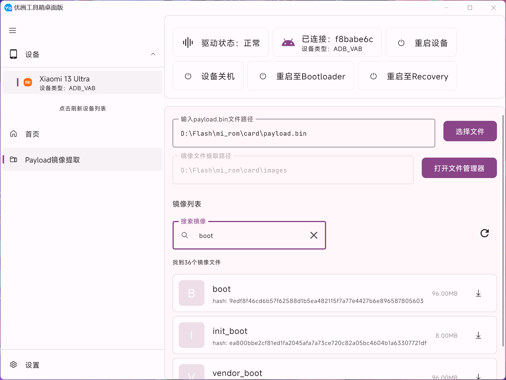

# yohub-desktop
 一个基于Jetpack Compose For Desktop实现的Android手机工具箱--桌面版

## 特性
- [x] 自动识别Android设备
- [x] 多设备操作
- [x] 主题可跟随系统
- [x] ADB操作
- [x] FASTBOOT操作
- [x] Payload提取镜像
- [ ] Magisk修补Boot.img（待实现）
- [ ] 刷写镜像（待实现）
- [ ] 一键Root（待实现）
- [ ] 安装Apk（待实现）
- [ ] 提取Apk（待实现）
- [ ] 更多特性欢迎您的提案

## 贡献者

## 程序截图（DEV-1.0.0）

## 讨论
* QQ群：945339560

## 功能持续开发中，敬请期待

