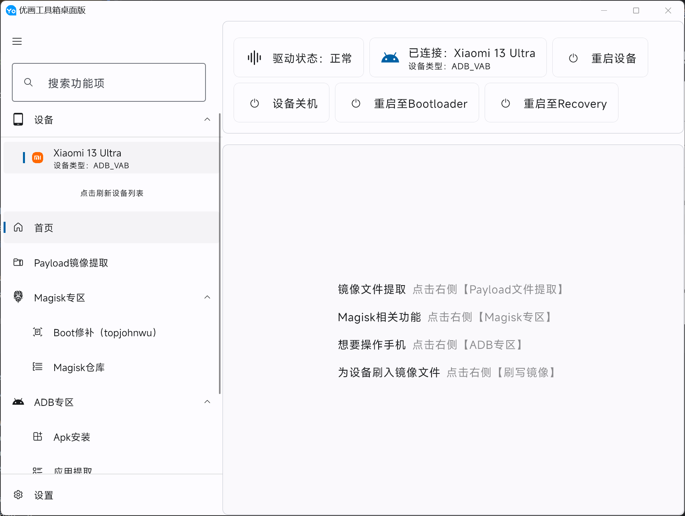
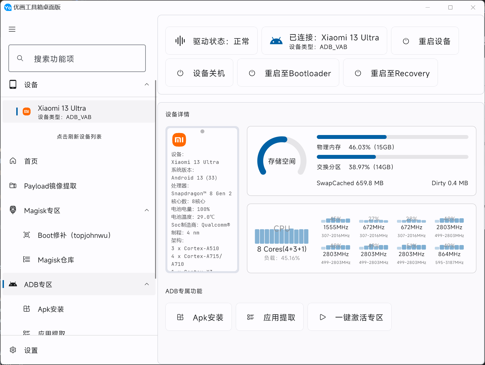
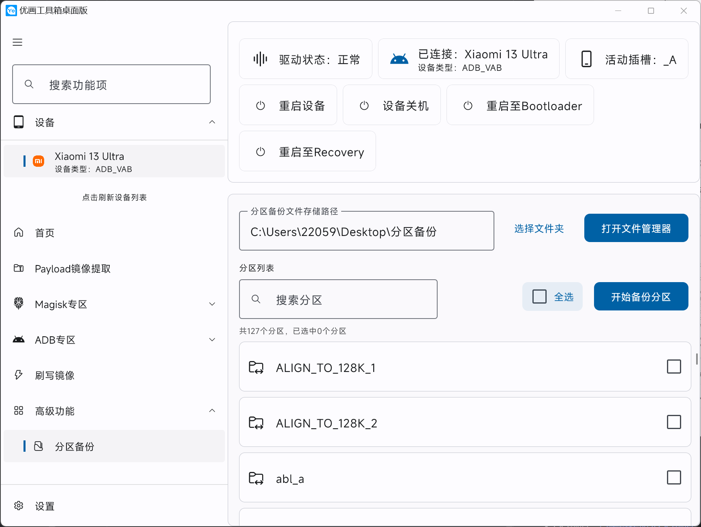

# YoHub For Desktop

 
你好呀！欢迎使用优画工具箱桌面版。这是一个专为Android设备设计开发的玩机工具箱，具有极具现代化的UI设计和一目了然的功能布局，既能方便发烧级玩家与大佬，又对初入搞机圈的小白非常友好，是2023年玩机不二之选~

# 下载
<a href="https://github.com/lumyuan/yohub-desktop/releases">GitHub</a>
 | 
<a href="https://www.123pan.com/s/kykmjv-m7Ji.html">123云盘（国内极速下载）</a>
 | 
<a href="https://pd.qq.com/s/9i3jrgcb1">QQ频道也能下载哦~</a>

## 特性
- [x] 安装即用
- [x] 自动识别Android设备
- [x] 多设备操作
- [x] 主题可跟随系统
- [x] 强大的主题自定义系统

## 功能
- payload提取镜像
- Magisk专区
  - 修补Boot（Root）
  - Magisk管理器下载（官方版与Delta）
- ADB专区
    - 设备状态实时监测
    - 应用安装
    - 应用提取
    - ADB一键激活
      - Shizuku一键激活
      - 黑域一键激活
      - 更多功能开发中...
- 镜像刷写（自动检测设备分区）
- 高级功能
   - 分区备份（备份字库等）

更多新功能敬请期待~~

## 程序部分界面截图（RELEASE-1.0.4）

## 讨论
* QQ群：945339560
* QQ频道：<a href="https://pd.qq.com/s/9i3jrgcb1">点击链接加入QQ频道</a>

## 贡献者

## 功能持续开发中，敬请期待

## Logo版权与许可
© Copyright @ 2023 优檀云网络科技 All Rights Reserved

本工具箱专为发烧级玩家开发并且免费使用，严禁使用本工具箱进行任何包括但不限于非法盈利或倒卖等活动，若一意孤行我司将使用法律途径进行维权，欢迎大家检举。
- 我司监事邮箱：2205903933@qq.com

LICENSE: [Apache 2.0](LICENSE)